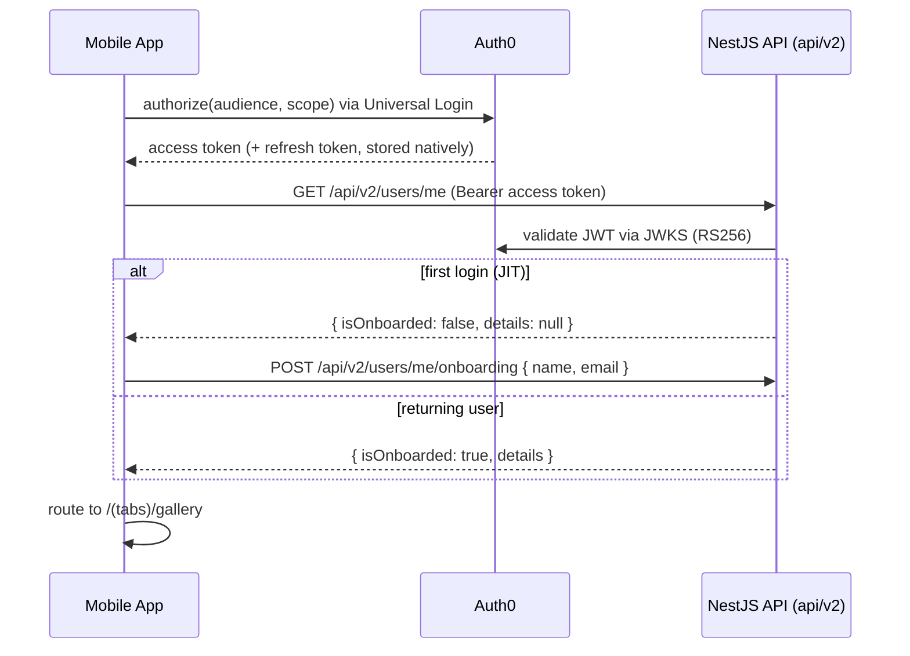

# Fix Auth0 Login/Signup in the Mobile App

## Root cause

The login/signup errors come from an architectural mismatch, not a small bug:

- The mobile app (`mobile/lib/auth.ts`) implements custom email/password auth, POSTing to `POST /api/auth/signin` and `POST /api/auth/signup` and expecting `{ user, accessToken, refreshToken }` back.
- The backend (`api/src/auth/jwt.strategy.ts`) is a stateless Auth0 JWT validator. It has no `/auth/*` endpoints, never issues tokens, and uses global prefix `api/v2` ([api/src/swagger/swagger.config.ts](api/src/swagger/swagger.config.ts) → `API_GLOBAL_PREFIX = "api/v2"`).

So `POST /api/auth/signin` → 404 → "Login Failed". Every other mobile call (`/api/events`, `/api/users/me`, `/api/photos/*`) also 404s for the same prefix reason, and `/api/photos/*` has no controller at all.

## Target architecture

## Backend: no code changes

The API is already correct for Auth0. It only needs real values in `api/.env` (currently placeholders in [api/.env.example](api/.env.example)): `AUTH0_DOMAIN` and `AUTH0_AUDIENCE`. The `AUTH0_AUDIENCE` MUST equal the API Identifier configured in Auth0 and match the audience the mobile app requests.

## Mobile changes

### Auth0 SDK + native config

- Install: `npx expo install react-native-auth0`.
- Add `app.config.ts` that spreads the existing [mobile/app.json](mobile/app.json) and injects the plugin `["react-native-auth0", { domain: process.env.EXPO_PUBLIC_AUTH0_DOMAIN, customScheme: "everglowmobile" }]`. Keeps config env-driven; `everglowmobile` scheme already exists.
- New [mobile/lib/auth0.ts](mobile/lib/auth0.ts): singleton `Auth0` client (domain + clientId from env) exposing `getAccessToken()` (reads/refreshes via `credentialsManager`), `hasValidCredentials()`, `clearCredentials()`.

### API client + auth service

- [mobile/lib/api.ts](mobile/lib/api.ts): set `baseURL` to `${EXPO_PUBLIC_API_URL}/api/v2`; request interceptor gets the token from the Auth0 credentials manager (auto-refresh) instead of SecureStore; drop the custom `/api/auth/refresh` 401 logic (Auth0 handles refresh) and on hard 401 clear session + route to `/login`.
- [mobile/lib/auth.ts](mobile/lib/auth.ts): remove signin/signup/refresh/token storage. Keep `getUserProfile()` → `GET /users/me`; add `completeOnboarding({ name, email })` → `POST /users/me/onboarding` (matches [api/src/users/dto/create-user-details.dto.ts](api/src/users/dto/create-user-details.dto.ts)).
- Update `User` type to the backend shape from [api/src/users/mappers/user.mapper.ts](api/src/users/mappers/user.mapper.ts): `{ id, isOnboarded, details: { name, email, createdAt, updatedAt } | null }`.

### Auth context + screens

- [mobile/context/auth-context.tsx](mobile/context/auth-context.tsx): wrap nothing here, but rework to expose `login()`, `signup()` (both call Auth0 `authorize`; signup passes `additionalParameters: { screen_hint: "signup" }`), `logout()` (Auth0 `clearSession`), `completeOnboarding()`, plus `user` and `isOnboarded`. On launch, if credentials valid → fetch `/users/me`.
- [mobile/app/_layout.tsx](mobile/app/_layout.tsx): wrap tree in `Auth0Provider` (domain/clientId from env) above `AuthProvider`; register an `onboarding` route; redirect authenticated-but-not-onboarded users to onboarding.
- [mobile/app/login.tsx](mobile/app/login.tsx) and [mobile/app/signup.tsx](mobile/app/signup.tsx): replace the email/password forms with a single Auth0 "Continue" button (Universal Login owns credentials/validation). Keep the existing styling/branding.
- New `mobile/app/onboarding.tsx`: collect name + email for first-time users → `completeOnboarding`.

### Realign remaining paths (scope: full)

- [mobile/lib/user.ts](mobile/lib/user.ts): `PUT /api/users/me` → `PATCH /users/me`; `DELETE /users/me`. `changePassword` has no backend endpoint and Auth0 owns passwords → remove it and its profile UI usage.
- [mobile/lib/event.ts](mobile/lib/event.ts): paths now resolve correctly under the new `/api/v2` baseURL (no per-call prefix needed); `joinByInvitationUrl` and participant routes match [api/src/events/events.controller.ts](api/src/events/events.controller.ts).
- Update screens reading `user.name`/`user.email` to `user.details?.name` etc. (profile, EventsScreen, events/[id]).

### Known limitation (flagged, out of scope)

`mobile/lib/photo.ts` targets `/photos/*`, but the API has no photos controller. After this fix those calls will still 404 until a backend photos module is built. I'll leave the client paths consistent and call this out; building the backend photo feature is a separate task.

### Env

- Add to `mobile/.env` / [mobile/.env.example](mobile/.env.example): `EXPO_PUBLIC_AUTH0_DOMAIN`, `EXPO_PUBLIC_AUTH0_CLIENT_ID`, `EXPO_PUBLIC_AUTH0_AUDIENCE`.

## Auth0 tenant setup (you do this in the Auth0 dashboard)

1. Create a Native application → copy Domain + Client ID into `mobile/.env`.
2. Create an API → its Identifier is `EXPO_PUBLIC_AUTH0_AUDIENCE` and also `api/.env`'s `AUTH0_AUDIENCE`. Enable "Allow Offline Access" for refresh tokens.
3. On the Native app, set Allowed Callback + Logout URLs (both platforms):
  - `everglowmobile://YOUR_DOMAIN/ios/com.anonymous.everglow-mobile/callback`
  - `everglowmobile://YOUR_DOMAIN/android/com.anonymous.everglowmobile/callback`
4. Put the same `AUTH0_DOMAIN`/`AUTH0_AUDIENCE` in `api/.env`.

## Rebuild & verify

Because native config changes (config plugin), a dev rebuild is required:

- API: `cd api && docker compose up --build`
- Mobile: `cd mobile && npx expo run:ios`
- Verify: tap Log In → Universal Login → first login routes to onboarding → `/(tabs)/gallery`; relaunch stays signed in (silent refresh); Log Out returns to login.

