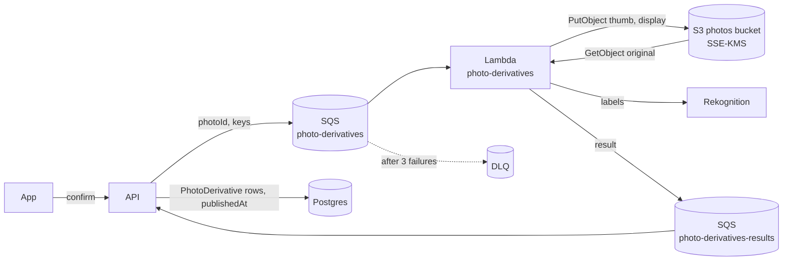

# Photo derivatives: thumbnails and display sizes

The target design for serving event photos at the size the screen needs, instead of the original. Nothing here is built yet; the issue is [EV-5](https://linear.app/mehrshadfb/issue/EV-5). The upload protocol it builds on is in [photos-architecture.md](./photos-architecture.md), and the privacy controls it must keep are in [photo-privacy.md](./photo-privacy.md).

## Built and planned

| Part                                                                                                         | Status  |
| ------------------------------------------------------------------------------------------------------------ | ------- |
| Queues, the derivatives Lambda's role, and the KMS, bucket policy and alert changes (§12)                    | Planned |
| The derivatives Lambda: decode, resize, ThumbHash, screening labels (§5, §7)                                 | Planned |
| `PhotoDerivative`, processing state, enqueue at confirm, the results consumer, retries and backfill (§6, §7) | Planned |
| Every delete path and the orphan reconciler cover derivatives (§11)                                          | Planned |
| Photos publish to other members once processed; screening runs for every format (§8)                         | Planned |
| `thumbnailUrl`, `displayUrl`, `width`, `height` and `thumbhash` on photo responses (§9)                      | Planned |
| Mobile: expo-image, cache keys, placeholders, the viewer (§10)                                               | Planned |
| CloudFront in front of the bucket (§13)                                                                      | Later   |

Issues for each part are filed once this design is agreed.

---

## 1. The problem

`GET /events/:eventId/photos` returns a presigned URL to each **original**: up to 25 MB, typically 2 to 5 MB. A grid of 50 photos can pull over 100 MB on cellular, and the app's grid (`mobile/features/events/components/event-photos-section.tsx`) renders those originals with React Native's `Image`, with no cache key, so every re-signed URL downloads the photo again.

Egress is also what costs money. In the scenario of §13, sending originals to the grid costs about **$7,600 a month**; derivatives bring it to about **$400**.

Three constraints shape the design:

- **Privacy.** Only the API's identity may read a photo, objects are encrypted with a key only the API may use, and every read lands in CloudTrail ([photo-privacy.md](./photo-privacy.md)). Derivatives are the same photo at a smaller size, so they get the same protection.
- **Prompt removal.** A deleted photo must be gone everywhere we serve it: gallery close, moderation removals, and the TAKE IT DOWN Act's 48 hours ([moderation.md](./moderation.md) §7).
- **HEIC.** iPhones upload HEIC by default, and neither sharp's prebuilt binaries nor Rekognition read it.

## 2. Decisions

| Question    | Decision                                                                        | Why                                                                                                                                                                                        |
| ----------- | ------------------------------------------------------------------------------- | ------------------------------------------------------------------------------------------------------------------------------------------------------------------------------------------ |
| When        | **Eagerly**, right after confirm                                                | Like Instagram, Pinterest and Telegram. Sizes resized on request (Google Photos, Discord) spread cached copies of private photos and re-render on every cache miss.                        |
| Where       | **An isolated AWS Lambda** (arm64), fed by SQS                                  | Decoding untrusted images is CPU- and memory-heavy and has a steady stream of parser CVEs. A Lambda with no database, no secrets and least-privilege IAM keeps both away from the API.     |
| Served by   | **Presigned S3 URLs**, as today                                                 | Keeps the one-reader, KMS and CloudTrail model unchanged. CloudFront comes later, as a cost decision (§13).                                                                                |
| Format      | **WebP** for both sizes                                                         | Fast to encode, decoded natively and quickly on iOS and Android, 25 to 34% smaller than JPEG. AVIF is smaller again but 4 to 25 times slower to encode and decodes slower on phones (§15). |
| Sizes       | `thumb`: 480 px short edge; `display`: 2048 px long edge                        | Sharp on a 3x phone in a 3-column grid, a 2×2 bento tile and full screen; the original is only for deep zoom and download (§5).                                                            |
| HEIC        | **libheif in WebAssembly** (`libheif-js`), then sharp                           | Stays on sharp's patched prebuilt binaries, and the riskiest parser runs inside a WASM sandbox. A native libvips build with libde265 is the fallback if throughput demands it.             |
| Placeholder | **ThumbHash**, stored on the photo row                                          | About 28 characters, keeps the aspect ratio, and expo-image renders it directly.                                                                                                           |
| Visibility  | Other members see a photo **once it is processed**, or once processing gives up | Every photo is screened before anyone else sees it, HEIC included, and nobody sees a blank tile. The uploader sees their own photo at once.                                                |

## 3. How the pieces fit



- **The Lambda never touches the database.** Everything it needs is in the message, and everything it learns goes back through the results queue. That works wherever the API is hosted, because the API reaches SQS with the AWS credentials it already has.
- **SQS, not an S3 event.** An S3 event fires on every upload, confirmed or not. The queue carries only confirmed photos, and it gives retries, a dead-letter queue and a backfill path for free.

## 4. What the user sees

1. The uploader picks photos. Their grid shows the local files at once, and keeps showing them after confirm (§10).
2. A few seconds after confirm the photo is processed: screened, resized and published.
3. Other members' grids show the ThumbHash blur, then the thumbnail.
4. Opening a photo shows the thumbnail (already in memory), then the display size.
5. Zooming past about 1.5× or tapping download fetches the original.

A photo that can't be processed is still published after a deadline, with the original as its only image (§7). Processing never loses a photo.

## 5. The derivatives

| Kind      | Size                                         | Format      | Typical size | Used for                      |
| --------- | -------------------------------------------- | ----------- | ------------ | ----------------------------- |
| `thumb`   | short edge 480 px, long edge at most 1440 px | WebP, q70   | 30–50 KB     | Grid tiles                    |
| `display` | long edge 2048 px                            | WebP, q75   | 300–600 KB   | Full screen, 2×2 bento tiles  |
| original  | unchanged                                    | as uploaded | 2–25 MB      | Deep zoom, download, evidence |

- **Never upscaled.** A photo smaller than a size gets a copy at its own size.
- **Upright.** EXIF orientation is applied (`autoOrient`). libheif applies HEIC's own rotation, so the HEIC path must not rotate twice; this is checked against real iPhone portrait shots before launch.
- **No metadata.** sharp strips EXIF (including GPS), XMP, IPTC and ICC from its output by default, and nothing here turns that back on. Originals are not touched; whether to strip them is [EV-94](https://linear.app/mehrshadfb/issue/EV-94).
- **Colour.** Output is sRGB. Display P3 colours outside sRGB are clipped, not washed out. Keeping P3 for `display` (`withIccProfile('p3')`) is a later improvement, once Android's handling is checked.
- **HDR.** Derivatives carry the SDR base image. Apple's gain maps are dropped, which is fine for browsing; the original keeps them.
- **Sizes were chosen** from the screen: a 3-column grid on a 430 pt phone at 3x needs about 430 px per tile, measured on the short edge so square crops stay sharp; a 2×2 tile needs about 860 px; full screen needs about 1320 by 1760 px, so 2048 px gives 1:1 pixels and room for a little zoom. Telegram's 320/800/1280/2560 and WhatsApp's 1600 px long edge sit in the same range.
- **The spec is versioned.** These sizes and qualities are spec `v1`. Changing them later means a `v2`: new keys, queued for every photo, old objects deleted once the new ones exist (§6).

## 6. Data model

```prisma
enum PhotoProcessingStatus {
  PENDING    // queued or being made
  PROCESSED  // derivatives exist
  FAILED     // gave up; served with the original only
}

enum PhotoDerivativeKind {
  THUMB
  DISPLAY
}

model Photo {
  // ...existing fields...

  // When other members can see the photo (§8). Null while it is processed.
  publishedAt           DateTime?
  processingStatus      PhotoProcessingStatus @default(PENDING)
  // When it was last queued, for the sweeper's deadline and retries.
  processingQueuedAt    DateTime?
  processingAttempts    Int                   @default(0)
  // Upright pixel size of the original, and its placeholder.
  width                 Int?
  height                Int?
  thumbhash             String?               @db.VarChar(64)

  derivatives           PhotoDerivative[]

  @@index([processingStatus, processingQueuedAt], where: { processingStatus: PENDING })
}

model PhotoDerivative {
  photoId     String              @db.Uuid
  kind        PhotoDerivativeKind
  specVersion Int
  s3Key       String              @unique @db.VarChar(255)
  contentType String              @db.VarChar(64)
  width       Int
  height      Int
  sizeBytes   Int
  createdAt   DateTime            @default(now())

  photo       Photo               @relation(fields: [photoId], references: [id], onDelete: Cascade)

  @@id([photoId, kind])
}
```

- **A table, not columns on `Photo`.** Kinds will grow (a poster frame for video, a second format), each row has its own key that the delete paths and the reconciler need, and `specVersion` lets a size change regenerate without a migration per field.
- **Keys sit under the photo's own key:** `{photo.s3Key}/v{specVersion}/{kind}.webp`, for example `photos/{uploaderId}/{eventId}/{photoId}/v1/thumb.webp`. They stay under `photos/`, so the bucket policy, KMS key and CloudTrail selectors already cover them. The version in the key means an object is never overwritten, so it can be cached as immutable. Built from `s3Key`, the rule also works for the pre-#38 `photos/{eventId}/{photoId}` rows.
- **Derivatives never count toward gallery storage.** Gallery usage sums `Photo.sizeBytes` ([photos-architecture.md](./photos-architecture.md) §9), and derivative bytes are never added to it. They are ours, like covers and avatars.
- **The migration** sets `publishedAt` to `createdAt` for every existing `READY` photo, so nothing disappears, and leaves them `PENDING`. That is the backfill: the sweeper queues them (§7).

## 7. The pipeline

### At confirm

Confirm flips the photos to `READY` as today. In the same statement it sets `processingQueuedAt`, then, after the commit, sends one SQS message per photo:

```json
{
  "photoId": "…",
  "s3Key": "photos/…/…/…",
  "specVersion": 1,
  "contentType": "image/heic"
}
```

If the send fails, nothing is lost: the photo stays `PENDING` and the sweeper re-queues it. The `Photo` row is the outbox.

### In the Lambda

One message per invocation, so a bad file only fails itself.

1. **Read** the original (`GetObject`, decrypted through the KMS key).
2. **Sniff the format from the bytes**, never from `contentType`. Read the dimensions from the header and refuse anything over the pixel limit before decoding: about 120 MP for JPEG, PNG and WebP (enough for 108 MP phone cameras; JPEG decodes with shrink-on-load), 50 MP for HEIC and HEIF (iPhones top out at 48 MP).
3. **Decode.** JPEG, PNG and WebP go straight to sharp. HEIC and HEIF are decoded by `libheif-js` to RGBA, then handed to sharp.
4. **Make** `thumb`, `display`, the ThumbHash (from a 100 px rendition), and an in-memory JPEG (about 1024 px, under Rekognition's 5 MB) for screening.
5. **Screen** that JPEG with `DetectModerationLabels` (bytes, not S3), returning labels at 50% confidence and above. The API applies its own threshold (§8).
6. **Write** both derivatives with `PutObject`: SSE-KMS, `Content-Type: image/webp`, `Cache-Control: private, max-age=31536000, immutable`.
7. **Report** the result to `photo-derivatives-results`: the photo id, `PROCESSED` or `FAILED` with a reason code, the upright `width` and `height`, the ThumbHash, each derivative's key, size and bytes, and the screening labels.

A file that is corrupt, unsupported or over the limit is a final answer: the Lambda reports `FAILED` and returns normally, so SQS doesn't retry it. Only infrastructure errors (S3, KMS, Rekognition, a timeout) throw, so SQS retries them. After 3 receives the message goes to the dead-letter queue, which alerts.

Lambda settings: arm64, 2048 to 3008 MB (memory buys CPU; a 48 MP HEIC peaks around 600 MB), 60 s timeout, a source queue visibility timeout of at least six times that, and **reserved concurrency of about 10**. That cap bounds cost and protects S3 and Rekognition if someone floods uploads. It also paces the backfill.

### In the API

A consumer long-polls `photo-derivatives-results` while `PHOTO_DERIVATIVES_ENABLED` is on. For each result, in one transaction:

1. If the photo is gone (deleted while processing), delete the derivative objects and stop.
2. Upsert the `PhotoDerivative` rows, set `width`, `height`, `thumbhash` and `processingStatus`.
3. Classify the screening labels and file the automated report if they warrant one (§8).
4. Set `publishedAt` if it is still null.

Every step is idempotent, because SQS delivers at least once.

### The sweeper

Every 5 minutes, alongside the other scheduled jobs (`runScheduledJob`, with its completed and failed heartbeat):

- re-queues `PENDING` photos queued more than 10 minutes ago, up to 3 attempts, then marks them `FAILED`;
- publishes any photo still unpublished 15 minutes after confirm, with the original only, and logs `photo.derivatives.publish_deadline` as a warning;
- queues backfill photos in batches, as fast as reserved concurrency allows.

**Failing open is deliberate,** and matches upload screening: a photo is never held back forever because our pipeline broke. A deadline publish is logged so it is visible, and a sustained rate of them is an alert.

## 8. Visibility and screening

- **A photo is visible to other members once `publishedAt` is set.** The uploader always sees their own photos. Organizers see unpublished photos no sooner than anyone else, because nothing has screened them yet. This becomes one more condition in `PhotoVisibilityService.whereVisibleTo` ([moderation.md](./moderation.md#the-shared-filter)); the rest of that filter is unchanged.
- **Screening moves into the pipeline.** Today it runs at confirm and skips HEIC and WebP, because Rekognition reads only JPEG and PNG ([moderation.md](./moderation.md) §11). The Lambda screens a JPEG it made itself, so every format is screened, and a flagged photo's automated report is filed in the same transaction that publishes it. It is hidden from everyone but organizers before anyone else could see it. The confirm-time call is removed in the same layer.
- **Screening stays behind its own flag** (`MODERATION_SCREENING_ENABLED`). With it off, the Lambda skips Rekognition and the API publishes on processing alone.

## 9. API contract

`PhotoResponseDto` gains five nullable fields, on the list and on `GET /photos/:photoId`:

| Field             | Meaning                                                                   |
| ----------------- | ------------------------------------------------------------------------- |
| `thumbnailUrl`    | Presigned GET for `thumb`; null until processed or when processing failed |
| `displayUrl`      | Presigned GET for `display`; same                                         |
| `width`, `height` | Upright pixel size of the original                                        |
| `thumbhash`       | Base64 ThumbHash placeholder                                              |

- `url` stays the original, for download, deep zoom and as the fallback. Older app versions keep working unchanged.
- Each URL is signed per request with the existing 15-minute TTL. Signing is local work, so three URLs per photo add no network calls.
- Contract change: the OpenAPI spec and `mobile/lib/api/generated` are regenerated in the same PR.

## 10. Mobile

The app work belongs to the mobile team; this is the behaviour the API is built for.

- **Use expo-image** with `cacheKey: "{photoId}:{kind}:v{specVersion}"` and `recyclingKey: photoId`, as the avatar and cover components already do. The presigned URL changes every request; the cache key doesn't, so a photo downloads once per device.
- **Grid:** `placeholder={{ thumbhash }}`, then `thumbnailUrl ?? url`, with a short transition. Use `width` and `height` to lay out the bento grid ([EV-53](https://linear.app/mehrshadfb/issue/EV-53)) before any pixels arrive.
- **Viewer:** the thumbnail as the placeholder, then `displayUrl ?? url`. Load the original only once a pinch ends past about 1.5×. Keep the neighbouring one or two photos mounted so they load ahead under their cache keys (`Image.prefetch` takes no cache key).
- **Download** uses `url`, as today.
- **The uploader's own photos** show the local file, written into the cache under the same keys (`Image.writeToCacheAsync`), so there is no flash when the server versions arrive.

## 11. Deletes and the orphan reconciler

Every path that deletes a photo's original must delete its derivatives too. A shared helper returns all of a photo's keys (`s3Key` plus its `PhotoDerivative` keys), collected before the row is deleted (the derivative rows cascade). The paths:

- a single photo delete, and confirm's `MISMATCHED` cleanup;
- leaving an event and removing a member with their photos;
- report verdicts, by organizers and by the platform;
- gallery close;
- event delete, and the platform's event delete;
- the account deletion purge;
- the stale `PENDING` cleanup (normally no derivatives, but a race can leave some).

`PhotoPurgeService.purgeObjects` already batches `DeleteObjects` by 1,000 keys, so the extra keys cost nothing new.

- **Evidence.** Only the original is quarantined to `evidence/` ([moderation.md](./moderation.md) §7). Derivatives are deleted with the photo: they add nothing a reviewer needs, and keeping fewer copies is the point.
- **The reconciler.** `isPhotoS3Key` today matches only the original's layout, so it would never reclaim a stray derivative, and the registry refuses a second source under `photos/`. `PhotoOrphanSource` therefore learns the derivative layout and treats a derivative key as referenced while a `PhotoDerivative` row names it. A derivative written for a photo deleted mid-processing is reclaimed this way if the consumer's cleanup in §7 was missed.
- **Spec changes.** When `v2` replaces `v1`, the consumer deletes the `v1` objects after the `v2` rows are written.

## 12. Security

- **Isolation.** The Lambda runs outside any VPC, with no database access and no secrets. If a decoder bug is exploited, the attacker holds a role that can read photos and write derivatives, not the database or the API's credentials.
- **Least privilege for the Lambda's role:**
  - `s3:GetObject` on `photos/*`, and `s3:PutObject` only on derivative keys (`photos/*/v*/*`);
  - `kms:Decrypt` and `kms:GenerateDataKey` on the photos key, added to its key policy;
  - an exemption in the bucket policy's `OnlyTheApiReadsPhotos` statement, by role ARN;
  - an exclusion in the `photo_read_by_person` alert, by the role's assumed-role ARN, so derivative runs don't page anyone;
  - `rekognition:DetectModerationLabels`, `sqs:ReceiveMessage` and `sqs:DeleteMessage` on its queue, `sqs:SendMessage` on the results queue, and CloudWatch Logs.

  The API's IAM user gains `sqs:SendMessage` on the input queue and receive and delete on the results queue. All of it is in Terraform, so the `privacy_controls_changed` alert fires when it is applied, as it should.

- **Decoding untrusted images.**
  - Pixel limits are checked from the header before decoding (§7). sharp's `limitInputPixels` enforces the same limit.
  - sharp's `failOn` stays at its strictest default (`warning`), and every operation has a timeout.
  - HEIC is decoded in WebAssembly, where memory corruption stays inside the module's own memory. libheif and libde265 had a run of security advisories in 2026; this keeps them sandboxed.
  - sharp's own libvips, libwebp and libheif (for AVIF) are native. They stay current through sharp releases; the 2023 libwebp heap overflow (CVE-2023-4863) shows why that matters. Dependabot covers `sharp` and `libheif-js`.
- **Metadata.** Derivatives carry no location or camera data (§5).
- **Auditing.** Every Lambda read of an original is a CloudTrail data event, like the API's own reads. [photo-privacy.md](./photo-privacy.md) names the role as the second identity allowed to read photos.

## 13. Cost

A month of 1,000 events, each with 30 members and 500 photos of 3 MB on average; each member browses the gallery twice, opens 50 photos full screen and downloads 20 originals. us-east-1 prices from AWS's price list on 2026-10-08; Lambda timings are estimates (2 GB, 1.5 s per JPEG, 3.5 s per HEIC, 30% HEIC).

| Option                                                                  | Main drivers                                                |      About |
| ----------------------------------------------------------------------- | ----------------------------------------------------------- | ---------: |
| Today: originals through presigned S3                                   | 96 TB of egress                                             |     $7,600 |
| **This design: eager derivatives, presigned S3**                        | 3.6 TB of egress ($315), Lambda ($23), storage and requests |   **$400** |
| The same behind CloudFront (pay as you go, or the $200 flat-rate plan)  | CloudFront egress and requests                              |   $260–320 |
| Resizing on request (AWS's Dynamic Image Transformation for CloudFront) | CloudFront, plus a re-render on every cache miss            |   $370–650 |
| Cloudflare Images / imgix / Cloudinary                                  | Per-transformation or credit pricing                        | $500–2,700 |

- **Derivatives are the saving:** 95% less egress. CloudFront saves another $80 or so, and changes how reads are audited, so it waits until egress passes about $250 a month (§16).
- **Processing is cheap:** about $0.00005 per photo in Lambda. At launch volumes it sits inside Lambda's and SQS's free tiers.
- **Screening is the larger per-photo cost.** Rekognition is about $0.001 an image, so moving HEIC into screening raises that line (in the scenario, roughly $500 a month for 500k photos). It stays behind its own flag, and the price is checked before turning it on.
- **Bucket Keys** keep KMS at about $1 a month instead of about $96; they are already on.

## 14. Rollout

The work ships as a stack, each layer behind flags that are off by default:

1. **Infra:** the two queues, the dead-letter queue and its alarm, the Lambda's role, and the KMS, bucket policy, alert and API-user changes (§12).
2. **The Lambda:** decode, resize, ThumbHash and screening labels, with a benchmark on real iPhone HEICs (12, 24 and 48 MP, portrait and landscape) and a CI step that builds the zip.
3. **API:** the schema and migration, enqueue at confirm, the results consumer and the sweeper (`PHOTO_DERIVATIVES_ENABLED`).
4. **API:** every delete path and the orphan reconciler (§11). This lands before the flag is turned on anywhere with real photos.
5. **API:** `publishedAt` visibility and screening in the pipeline (§8), after #195.
6. **API contract:** the new response fields and the regenerated mobile client (§9).

The mobile work (§10) follows layer 6. Turning it on: apply the Terraform, deploy the Lambda, set `PHOTO_DERIVATIVES_ENABLED=true`, watch the backfill drain and the dead-letter queue stay empty.

New config, all in `.env.example`: `PHOTO_DERIVATIVES_ENABLED`, `AWS_SQS_PHOTO_DERIVATIVES_QUEUE_URL`, `AWS_SQS_PHOTO_DERIVATIVES_RESULTS_QUEUE_URL`. New log events: `photo.derivatives.queued`, `photo.derivatives.processed`, `photo.derivatives.failed`, `photo.derivatives.publish_deadline`, and the sweeper's heartbeat; the alerts are added to [alerting.md](../api/docs/alerting.md).

## 15. Alternatives considered

- **Resize inside the API process.** No new infrastructure, but a 48 MP HEIC takes seconds of CPU and hundreds of MB, competing with requests in the same container, and a decoder exploit would land next to the database credentials.
- **Resize on request at the edge.** AWS's Dynamic Image Transformation for CloudFront doesn't accept HEIC, authorizes with a shared signature rather than per user, and re-renders on every cache miss. S3 Object Lambda is closed to new customers since November 2025.
- **A managed service** (Cloudflare Images, imgix, Cloudinary). Two to six times the cost, and each one becomes a second party holding or reading our users' photos, outside our KMS key and CloudTrail. imgix needs an access key to read the bucket; Cloudflare's resizing of restricted origins expects images in a public cache. That breaks "only our API reads your photos".
- **Make derivatives on the phone.** Free, and the phone decodes HEIC natively, but the server would trust a thumbnail it never checked: a harmless thumbnail over an offensive original gets past members' eyes and screening alike. Shrinking the upload on the phone is a separate question ([EV-94](https://linear.app/mehrshadfb/issue/EV-94)).
- **AVIF.** About 40% smaller than WebP in a quick benchmark at these sizes (quality not matched), but 4 to 25 times slower to encode, and phones decode it in software: Meta measured 3× slower decoding in the Facebook iOS story viewer, and images loading slower overall. Worth an A/B test for `display` later.
- **A native libvips with libde265 for HEIC.** Faster, but we'd compile it ourselves, rebuild it on every libheif and libde265 advisory, and lose sharp's patched prebuilt binaries. It is the fallback if HEIC throughput or cost becomes a problem.

## 16. Open questions

- **Hosting.** The design doesn't depend on it, but if the API moves into AWS, the API user's static keys should become a role.
- **CloudFront.** When egress passes about $250 a month: Origin Access Control (it supports SSE-KMS), signed cookies per event, cache tags so a photo's delete invalidates its edge copies in seconds, and short client cache lifetimes. The read audit then moves from CloudTrail to CloudFront's access logs, so [photo-privacy.md](./photo-privacy.md) changes with it.
- **P3 colour** for `display`, once Android's handling is checked (§5).

## 17. Out of scope

- Video
- Stripping metadata from originals ([EV-94](https://linear.app/mehrshadfb/issue/EV-94))
- "Download all" ([EV-74](https://linear.app/mehrshadfb/issue/EV-74)), which hands out originals
- Event covers and avatars, which are already small and stay as they are ([image-uploads.md](./image-uploads.md))
